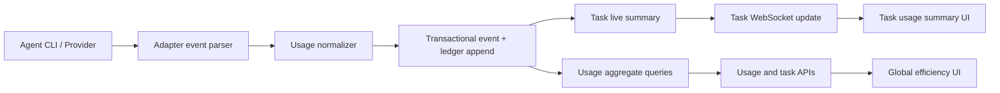

# Token Efficiency Observability Design

**Status:** Accepted for phase 1 implementation
**Date:** 2026-07-18
**Decision:** [ADR 0006](../adr/0006-request-level-usage-ledger.md)

## 1. Outcome and scope

Kin will make token efficiency inspectable at task and aggregate levels without
requiring a proxy or changing how users authenticate their existing agents.
Phase 1 records request/turn usage, normalizes cache fields, calculates a
coverage-aware cache hit rate, and displays the result in the task detail and
Usage pages. Phase 2 adds best-effort provider/account limit snapshots.

Phase 1 includes:

- request/turn-level usage ledger in SQLite;
- Codex, Claude Code, Grok, and Kin/provider normalization;
- task-level token/cache/cost summary;
- date × agent usage aggregation;
- task detail and global Usage UI;
- explicit reported, unknown, unsupported, and mixed states;
- English and Chinese UI text and regenerated `web/dist/`.

Phase 1 does not include:

- mandatory traffic proxying;
- historical cache backfill;
- automatic routing or prompt rewriting;
- a provider price catalog overhaul;
- inferred subscription limits.

## 2. Functional and non-functional requirements

### Functional

1. Record each incremental model usage report once.
2. Attribute usage to task, event, agent, model, source, and occurrence time.
3. Preserve input, output, reasoning output, cache read, and cache write tokens
   when reported.
4. Distinguish a reported zero from a missing or unsupported cache field.
5. Show task totals and cache hit rate without adding noise to every chat turn.
6. Show time-range totals and per-agent efficiency on the existing Usage page.
7. Preserve current task and usage API clients through additive fields.

### Non-functional

- **Correctness:** event, usage row, and task summary commit atomically.
- **Idempotency:** `(task_id, event_seq)` prevents duplicate ledger rows.
- **Local-first:** telemetry remains in the local Kin SQLite database.
- **Privacy:** store counts and metadata, never prompts, credentials, or raw
  provider headers in the ledger.
- **Performance:** summary queries use an occurrence-time index and remain
  bounded to at most 366 days.
- **Compatibility:** old tasks remain readable and expose cache as unknown.
- **Degradation:** unsupported providers still report ordinary token totals.

## 3. Data model

```sql
CREATE TABLE usage_records (
  task_id                 TEXT NOT NULL REFERENCES tasks(id),
  event_seq               INTEGER NOT NULL,
  occurred_at             INTEGER NOT NULL,
  agent                   TEXT NOT NULL,
  provider                TEXT,
  model                   TEXT,
  input_tokens            INTEGER,
  output_tokens           INTEGER,
  reasoning_output_tokens INTEGER,
  cache_read_tokens       INTEGER,
  cache_write_tokens      INTEGER,
  cost_usd                REAL,
  cost_source             TEXT NOT NULL,
  cache_status            TEXT NOT NULL,
  input_semantics         TEXT NOT NULL,
  PRIMARY KEY (task_id, event_seq)
);
```

`input_semantics` controls the cache denominator:

| Semantics | Providers | Logical input denominator |
|---|---|---|
| `total_includes_cache` | Codex/OpenAI-compatible | `input_tokens` |
| `uncached_only` | Claude usage shape | `input + cache_read + cache_write` |
| `unknown` | Generic/partial adapters | no hit rate |

Cache hit rate is:

```text
sum(cache_read_tokens for eligible records)
────────────────────────────────────────────
sum(logical input tokens for eligible records)
```

The API also returns coverage: eligible logical input divided by all known
logical input. A mixed aggregate can therefore say that a 74% hit rate is based
on 81% of observed input instead of silently treating unknown calls as misses.

The `tasks` table remains the live read model. It gains cache read/write totals,
reasoning output, cache status, and observed/eligible input counters. New usage
records update these fields in the same transaction.

## 4. Ingestion and data flow



The canonical accounting event differs by adapter:

| Source | Canonical event | Duplicate prevention |
|---|---|---|
| Codex | `usage` from `turn.completed` | ignore usage in following `result` |
| Kin/provider | each provider-round `usage` | ignore cumulative final `result` |
| Claude Code | normalized `usage` emitted before `result` | result is lifecycle only |
| Grok | normalized `usage` emitted from end event | result is lifecycle only |
| Generic/raw PTY | result fallback when structured usage exists | one fallback per run |

The normalizer rejects negative counts and malformed payloads without failing
the task. The original event remains in the audit stream; a short diagnostic
event records why accounting was skipped.

## 5. API and UI

`GET /api/tasks/{id}/usage` returns the task summary plus model/source subtotals.
The existing `GET /api/usage/summary` adds cache totals, hit rate, coverage,
request count, and cache status while preserving existing fields.

Task detail receives a compact, expandable summary below the header:

- total Token and input/output split;
- cache hit rate and coverage;
- cached read/write and reasoning breakdown when available;
- cost and whether it is provider-reported or estimated.

The global Usage page adds Cache Hit Rate as a fourth KPI and cache detail to
the per-agent rows. It retains the current daily spend chart; phase 1 does not
add another chart. Narrow layouts use a 2×2 KPI grid. Cache state is conveyed by
text, not color alone, and the details control uses `aria-expanded`.

## 6. Limits: phase 2

Account limits use a separate provider capability and snapshot store:

```text
LimitCollector.Snapshot(ctx) -> []LimitWindow
```

Codex can use the official App Server account rate-limit RPC. Claude API mode
can use rate-limit headers or the organization API when authorized; Claude Code
subscription mode can consume a structured `rate_limit_event` when present.
The UI shows only reported windows, including source, used percentage, reset
time, and freshness. Unsupported and temporarily unavailable are distinct.

No phase 1 API or schema claims subscription headroom, so phase 2 can be added
without changing cache or cost accounting.

## 7. Failure modes and mitigations

| Failure | Effect | Mitigation |
|---|---|---|
| Duplicate usage and result payloads | inflated totals | canonical event rules and ledger PK |
| Crash between event and usage write | missing accounting | one SQLite transaction |
| Provider omits cache fields | false 0% | explicit cache status and nullable counts |
| Provider changes payload shape | dropped metric | parser fixtures; retain raw event for diagnosis |
| Mixed provider semantics | invalid denominator | normalize input semantics before aggregation |
| Unknown model price | misleading `$0` | nullable cost and `cost_source=unknown` |
| Old tasks lack ledger rows | incomplete history | preserve old totals; cache is unknown |

## 8. Verification strategy

- migration tests for empty and populated v4 databases;
- table-driven normalizer tests for each adapter and cache state;
- engine tests proving Codex and Kin are not double counted;
- API tests for reported zero, non-zero, unknown, unsupported, and mixed data;
- pure UI formatter/state tests plus TypeScript build;
- desktop and narrow-width inspection of task detail and Usage page;
- full `go test ./...`, `go vet ./...`, UI tests, and UI production build.
